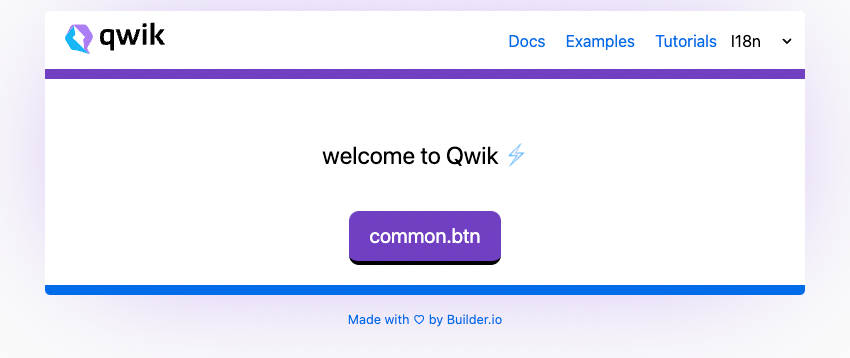

  

Mocking Up SSR Web App With <b>Qwik</b><em>(speed)</em> 

 

<a href="https://fast-qwik.netlify.app//">Live Demo</a>

 

## Features

- ⚡️ [qwik](https://qwik.builder.io/), [Vite](https://github.com/vitejs/vite), [pnpm](https://pnpm.io/) - best partner to ssr

- 🗂 [File based routing](./src/routes)

- 🎨 [TailwindCss](https://github.com/antfu/unocss) - the instant on-demand atomic CSS engine

- 😃 [Use icons from any icon sets with classes](https://github.com/antfu/unocss/tree/main/packages/preset-icons)

- 🌍 [I18n ready](./public/i18n)

- 🗒 Ready [Global Store Management](https://qwik.builder.io/docs/components/context/)

- 🦾 TypeScript, of course

- ⚙️ Unit Testing with [Vitest](https://github.com/vitest-dev/vitest), E2E Testing with [Cypress](https://cypress.io/) on [GitHub Actions](https://github.com/features/actions)

- ☁️ Deploy on Netlify, zero-config

 
